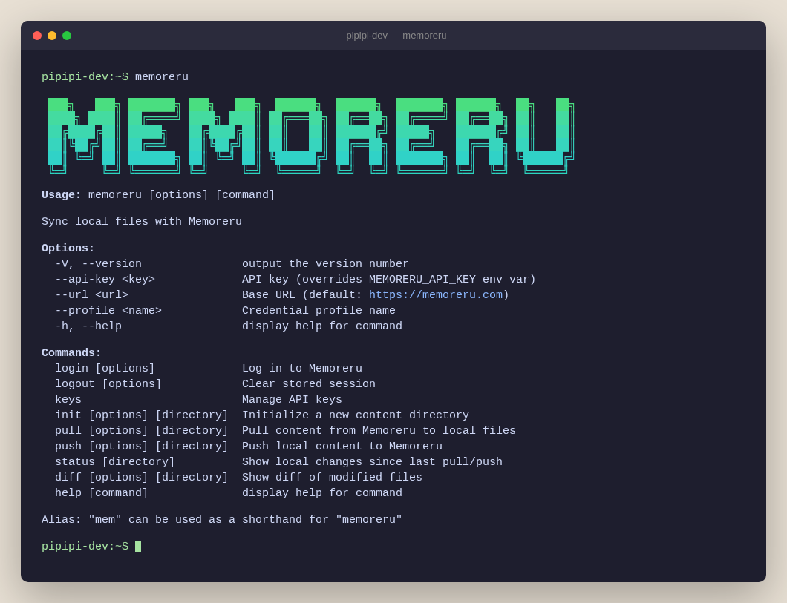

# Memoreru CLI

[English](README.md)

ローカルの Markdown、CSV、JSON ファイルと [Memoreru®](https://memoreru.com) を同期するコマンドラインツール。



## ✨ 機能

- 🌐 **Login** — ブラウザ認証（CAPTCHA/2FA/OAuth 対応）
- 🗝️ **Keys** — CLI から API キーの作成・一覧・無効化
- 🐣 **Init** — プロジェクトのテンプレートを生成
- 🤲 **Pull** — Memoreru のコンテンツをローカルにダウンロード
- 🚀 **Push** — ローカルファイルを Memoreru にアップロード
- 🚦 **Status** — 前回の同期からのローカル変更を表示
- 🔍 **Diff** — push 前にファイル単位の差分を確認
- 🖼️ **画像** — push 時に自動アップロード、pull 時に変更分だけダウンロード
- 🏷️ **豊富なメタデータ** — カテゴリ、タグ、サムネイル、日時、場所など
- 🛡️ **安全な同期** — 複数人で同じテーブルを編集しても競合を検知
- 🤖 **Claude Code** — CLI スキルと MCP で AI アシスト

## 🪄 クイックスタート

```bash
# インストール不要で実行
npx @memoreru-sdk/cli --help

# グローバルインストール
npm install -g @memoreru-sdk/cli
```

> 💡 `mem` は `memoreru` の省略形エイリアスです。どちらでも同じように動作します。

## 🌱 セットアップ

### 方法 A: CLI ログイン（推奨）

```bash
memoreru login
```

ブラウザが開き認証します。ログイン後、API キーを作成:

```bash
memoreru keys create
```

> 💡 API キーの利用にはライトプラン以上が必要です。14日間の無料トライアルでもお試しいただけます。

### 方法 B: 手動で API キーを設定

1. [Memoreru](https://memoreru.com) にログイン
2. **設定 > セキュリティ > API キー** を開く
3. アクセス権限を **読み取り+書き込み** にしてキーを作成

```bash
export MEMORERU_API_KEY=your-api-key
```

これで `memoreru init`、`memoreru pull`、`memoreru push` が使えます。

## 💡 使い方

### Login / Logout

```bash
memoreru login                        # ブラウザ認証
memoreru login --profile work         # 名前付きプロファイルに保存
memoreru logout                       # default プロファイルを削除
memoreru logout --all                 # 全プロファイルを削除
```

### Keys

```bash
memoreru keys create                          # API キー作成（読み取り+書き込み）
memoreru keys create --name "my-key"          # 名前を指定
memoreru keys create --read-only              # 読み取り専用
memoreru keys list                            # 一覧表示
memoreru keys revoke mk_xxxxx                 # プレフィックスで無効化
```

### Init

```bash
memoreru init ./my-page                  # ページ（デフォルト）
memoreru init ./my-table --type table    # テーブル
memoreru init ./my-folder --type folder  # フォルダ
```

### Pull

```bash
memoreru pull                    # カレントディレクトリに取得
memoreru pull ./my-data          # 指定ディレクトリに取得
memoreru pull ./my-data --preview  # プレビュー（書き込みなし）
```

対応タイプ:
- **フォルダ** → ディレクトリ構造
- **ページ / スライド** → `.md`（画像 → `images/`）
- **テーブル** → `.csv`
- **ビュー / グラフ / ダッシュボード** → `.json`

> ⚠️ ビュー / グラフ / ダッシュボードの設定には内部IDが含まれます。同一環境内での pull/push は可能ですが、異なる環境間の移行には対応していません。

### Push

```bash
memoreru push                    # カレントディレクトリからアップロード
memoreru push ./my-data          # 指定ディレクトリからアップロード
memoreru push ./my-data --preview  # プレビュー（アップロードなし）
```

### Status

前回の pull / push からのローカル変更を表示します。

```bash
memoreru status                  # カレントディレクトリの変更を表示
memoreru status ./my-data        # 指定ディレクトリの変更を表示
```

```
  memoreru status

  Modified:
    M  readme.md (page) "プロジェクト README" [body]

  New (not yet pushed):
    +  new-page.md (page) "新しいページ"

  2 content(s): 1 modified, 1 new
```

API キー不要 — 完全オフラインで動作します。

### Diff

変更されたファイルの差分を unified diff 形式で表示します。

```bash
memoreru diff                          # 全ての差分を表示
memoreru diff --file readme.md         # 特定ファイルの差分のみ表示
```

```diff
diff --git a/readme.md b/readme.md
--- a/readme.md
+++ b/readme.md
@@ -3,7 +3,7 @@
 ## セクション1

-古い内容
+新しい内容

 ## セクション2
```

API キー不要 — ローカルに保存されたスナップショットと比較します。出力は `git apply` 互換です。

## 🎯 ファイル構成

`.memoreru.json` マニフェストでコンテンツを管理します。**記載したものだけ**が同期対象です。

```
my-project/
├── .memoreru.json          # マニフェスト
├── .memoreru/              # 同期状態（自動生成、.gitignore に追加推奨）
├── readme.md               # ページ
├── tasks.csv             # テーブル（push 後は row_id + version 付き）
├── tasks.bak.csv         # 元の CSV バックアップ（初回 push 時に自動生成）
├── docs/                   # フォルダ
│   ├── .memoreru.json      # docs/ 内のマニフェスト
│   └── guide.md
└── images/
    └── logo.png            # Markdown から参照
```

> ⚠️ キーはファイル名・ディレクトリ名のみ。フォルダの中身は**自動アップロードされません** — サブディレクトリに `.memoreru.json` を配置してください。
>
> 💡 `.memoreru/` は `.gitignore` に追加してください — `status` / `diff` 用の同期スナップショットが保存されます。

### .memoreru.json

```json
{
  "readme.md": {
    "content_type": "page",
    "title": "プロジェクト README"
  },
  "tasks.csv": {
    "content_type": "table",
    "title": "タスク一覧"
  },
  "docs": {
    "content_type": "folder",
    "title": "ドキュメント"
  }
}
```

初回 push 後、ID が自動的に書き戻されます:

```json
{
  "readme.md": {
    "content_id": "q589jor87vmbnyylb8091cik",
    "content_type": "page",
    "title": "プロジェクト README"
  },
  "tasks.csv": {
    "content_id": "dyn8dapi7ckz8vvic8indjnc",
    "content_type": "table",
    "title": "タスク一覧",
    "columns": [
      { "id": "col_abc123", "name": "タイトル", "type": "string" },
      { "id": "col_def456", "name": "ステータス", "type": "string" },
      { "id": "col_ghi789", "name": "優先度", "type": "string" }
    ]
  }
}
```

テーブルの場合、`columns` にカラムIDが書き戻されます。ビュー・グラフがカラムを参照する際の一意なIDです。

### プロパティ

`content_type` のみ必須。それ以外は省略可能です。

<details>
<summary><strong>基本情報</strong></summary>

| プロパティ | 説明 |
|-----------|------|
| `content_id` | 初回 push 後に自動設定 |
| `content_type` | **必須**。`folder`, `page`, `table`, `slide`, `view`, `graph`, `dashboard` |
| `title` | 省略時はファイル名から推定 |
| `scope` | `public`, `team`, `private`（デフォルト: `private`） |
| `description` | 説明文 |
| `description_expanded` | 説明を展開表示（デフォルト: `false`） |
| `category` | カテゴリ名またはキー |
| `label` | ラベル |
| `tags` | タグ名の配列（例: `["React", "チュートリアル"]`） |
| `slug` | カスタムURL スラッグ（有料プラン） |

</details>

<details>
<summary><strong>追加情報</strong></summary>

| プロパティ | 説明 |
|-----------|------|
| `thumbnail` | サムネイル画像パス（例: `./images/thumb.png`） |
| `emoji` | 絵文字アイコン |
| `date_type` | `year`, `month`, `date`, `datetime` |
| `date_start` | 開始日時（例: `2026-01-15`） |
| `date_end` | 終了日時 |
| `location_lat` | 緯度 |
| `location_lng` | 経度 |
| `location_address` | 住所 |
| `location_name` | 場所名 |
| `persons` | 人物名の配列（例: `["田中太郎"]`） |
| `sources` | 参考文献 |
| `language` | 言語コード（デフォルト: `en`） |

</details>

<details>
<summary><strong>公開設定</strong></summary>

| プロパティ | 説明 |
|-----------|------|
| `team_id` | チームID（scope が `team` の場合に必要） |
| `parent_id` | 親フォルダの content_id |
| `publish_status` | `draft` または `published`（デフォルト: `published`） |
| `scheduled_at` | 予約公開日時（ISO 8601） |
| `expires_at` | 公開期限（ISO 8601） |
| `is_suspended` | 一時停止（デフォルト: `false`） |
| `is_archived` | アーカイブ（デフォルト: `false`） |

</details>

<details>
<summary><strong>プライバシー</strong></summary>

| プロパティ | 説明 |
|-----------|------|
| `discovery` | `listed`, `unlisted`, `profile`（デフォルト: `listed`） |
| `access_level` | `open`, `login_required`, `followers_only`（デフォルト: `open`） |
| `can_embed` | 埋め込み許可（デフォルト: `true`） |
| `can_ai_crawl` | AIクローラー許可（デフォルト: `true`） |
| `can_hatena_comment` | はてなブックマークのコメント許可（デフォルト: `true`） |
| `has_password` | パスワード保護（デフォルト: `false`） |

</details>

<details>
<summary><strong>その他</strong></summary>

| プロパティ | 説明 |
|-----------|------|
| `is_pinned` | ピン留め（デフォルト: `false`） |
| `is_locked` | 編集ロック（デフォルト: `false`） |
| `auto_summary` | 要約を自動生成（デフォルト: `false`） |
| `auto_translate` | 翻訳版を自動生成（デフォルト: `false`） |

</details>

<details>
<summary><strong>テーブルカラム（自動管理）</strong></summary>

| プロパティ | 説明 |
|-----------|------|
| `columns` | カラム定義（table のみ）。push 後に自動設定。`{ id, name, type }` の配列。 |

カラムIDにより、ビュー・グラフからの参照が一意に保たれます。カラム名を変更するには、CSV のヘッダーと `.memoreru.json` の `columns[].name` を両方更新してください。

</details>

### テーブル CSV

**初回 push 前**（元の CSV）:

```csv
タイトル,ステータス,優先度
CI構築,完了,高
ドキュメント作成,進行中,中
```

**初回 push 後**（row_id + version が追加され、元ファイルは `.bak.csv` にバックアップ）:

```csv
row_id,version,タイトル,ステータス,優先度
row_abc123,1,CI構築,完了,高
row_def456,1,ドキュメント作成,進行中,中
```

- `row_id` と `version` はシステム管理列（先頭2列）
- カラム型は push 時に自動推定
- 2回目以降の push では変更行のみ送信（差分push）
- version 不一致で競合を検知（共同編集時の安全性）

**新しい行を追加** — `row_id` と `version` は空のまま:

```csv
row_id,version,タイトル,ステータス,優先度
row_abc123,1,CI構築,完了,高
row_def456,1,ドキュメント作成,進行中,中
,,テスト追加,未着手,低
```

### 画像

```markdown

```

- **Pull**: 変更分だけダウンロード
- **Push**: 自動アップロード

## 🎨 オプション

```
--api-key <key>     API キー（MEMORERU_API_KEY より優先）
--profile <name>    プロファイル名
--url <url>         ベースURL（デフォルト: https://memoreru.com）
--help              ヘルプ表示
--version           バージョン表示
```

**環境変数:**

| 変数 | 説明 |
|------|------|
| `MEMORERU_API_KEY` | API キー |
| `MEMORERU_TENANT` | テナントスラッグ（専用テナント利用時に推奨） |
| `MEMORERU_URL` | ベースURL（デフォルト: `https://memoreru.com`） |

> 💡 **専用テナント利用者向け:** `MEMORERU_TENANT` を設定すると、誤ったテナントへの操作を防止できます。pull/push の前にテナントを検証し、不一致の場合はエラーで停止します。

### 認証の優先順位

1. `--api-key` フラグ
2. `MEMORERU_API_KEY` 環境変数
3. `--profile` フラグ
4. `.memoreru-config.json` のプロファイル
5. `~/.config/memoreru/credentials.json` の default プロファイル

### .memoreru-config.json

ディレクトリ単位のプロファイル設定:

```json
{
  "profile": "work"
}
```

`memoreru push ./my-dir` 実行時、そのディレクトリの `.memoreru-config.json` からプロファイル（API キー）を自動解決します。

## 🤖 Claude Code 連携

[Claude Code](https://claude.ai/code) と組み合わせると、自然言語でコンテンツを操作できます。

**CLI スキル（ファイル同期）** — Claude Code に pull/push の使い方を教える:

```bash
cp -r node_modules/@memoreru-sdk/cli/skills/memoreru-cli ~/.claude/skills/
```

**MCP（データ操作）** — プロジェクトルートに `.mcp.json` を作成:

```json
{
  "mcpServers": {
    "memoreru": {
      "url": "https://memoreru.com/api/mcp/",
      "headers": {
        "Authorization": "Bearer your-api-key"
      }
    }
  }
}
```

**使い分け:**
- ⚡ **CLI** — ファイル同期 + Git バージョン管理
- 🔌 **MCP** — データ直接操作（行追加、検索、更新）

## 🧩 プログラマティック API

```typescript
import { configure, pullContent, pullTableData, upsertContent } from '@memoreru-sdk/cli';
import type { UpsertInput } from '@memoreru-sdk/cli';

configure({
  baseUrl: 'https://memoreru.com',
  apiKey: 'your-api-key',
});

const page = await pullContent('q589jor87vmbnyylb8091cik');
const table = await pullTableData('dyn8dapi7ckz8vvic8indjnc');

const input: UpsertInput = {
  content_type: 'page',
  title: 'My Page',
  body: '# Hello',
};
const result = await upsertContent(input);
```

## 🛸 ライセンス

MIT

## 商標

「Memoreru」は日本国内において当事業者の登録商標です（第9類、第42類 / 出願番号: 商願2026-6250）。

---

Made with ❤️ for knowledge creators

Sync your content, own your workflow!
